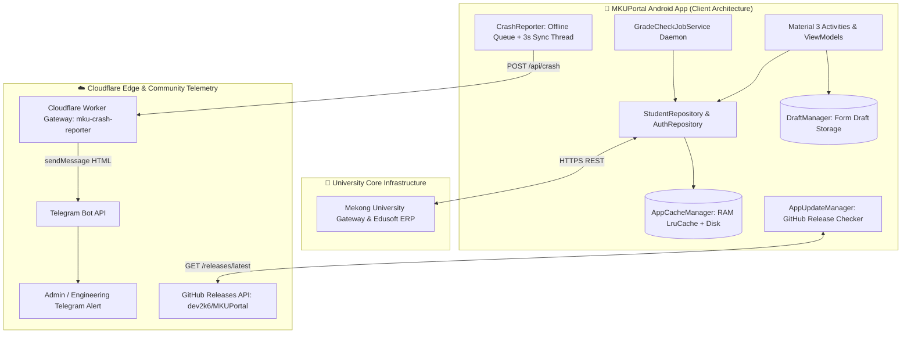

<div align="center">

  

  # MKUPortal
  ### The High-Performance, Community-Driven Android Client for Mekong University
  *Tra Cứu Học Tập & Thông Tin Sinh Viên Trường Đại Học Cửu Long*

  <p align="center">
    <a href="https://github.com/dev2k6/MKUPortal/releases/latest"></a>
    <a href="https://github.com/dev2k6/MKUPortal/releases"></a>
    <a href="https://developer.android.com/"></a>
    <a href="LICENSE"></a>
  </p>

  <p align="center">
    <a href="https://workers.cloudflare.com/"></a>
    <a href="https://core.telegram.org/bots/api"></a>
    <a href="https://openjdk.org/projects/jdk/11/"></a>
    <a href="https://m3.material.io/"></a>
    <a href="https://github.com/dev2k6/MKUPortal/stargazers"></a>
    <a href="https://github.com/dev2k6/MKUPortal/network/members"></a>
  </p>

  <p align="center">
    <b>Empowering thousands of students at Mekong University with instantaneous academic lookups, offline schedule persistence, background grade change alerts, and edge telemetry.</b>
  </p>

  <p align="center">
    <a href="#-about-mkuportal">About</a> •
    <a href="#-why-mkuportal-performance-benchmark">Benchmark</a> •
    <a href="#-key-features">Features</a> •
    <a href="#-system-architecture">Architecture</a> •
    <a href="#-telemetry--edge-gateway-cloudflare-worker">Crash Telemetry</a> •
    <a href="#-auto-update-engine-github-releases">Auto-Updates</a> •
    <a href="#-building-from-source">Quickstart</a> •
    <a href="#-developer--maintainer">Developer</a>
  </p>

</div>

---

## 🎓 About MKUPortal

Located along National Highway 1A in Phu Quoi, Long Ho District, Vinh Long Province, in the heart of the Mekong Delta, Vietnam, **Mekong University** (*Trường Đại Học Cửu Long - MKU*) is home to over 10,000 dynamic students across information technology, engineering, health sciences, economics, and law.

While the university's desktop educational portal provides comprehensive academic administration, students frequently face mobile browser hurdles: session timeouts, clunky navigation on small screens, and the hassle of repeatedly logging in just to check schedules or grades.

**MKUPortal** (*Cổng thông tin sinh viên Đại Học Cửu Long*) is an independent, community-driven open-source mobile client crafted to solve these everyday challenges. From instantaneous grade lookups (*tra cứu kết quả học tập*) and weekly timetables (*lịch học*) to examination timetables (*lịch thi*) and tuition management (*tra cứu học phí*), MKUPortal ensures that essential student tools are always within reach—fast, elegant, and fully accessible even when offline.

---

## 💡 Why MKUPortal? (Performance Benchmark)

Traditional university web portals often struggle on mobile browsers: repetitive session logins, high data latency, zero offline capabilities, and lack of push alerts when new exam grades arrive. **MKUPortal** was engineered from the ground up to solve these pain points with modern mobile engineering:

| Feature Dimension | Standard University Mobile Web | 🚀 MKUPortal Native App |
| :--- | :--- | :--- |
| **Initial Load & Display** | 3.5s – 5.8s (re-fetching complete HTML) | **0ms (Zero-Copy RAM Cache)** |
| **Offline Operation** | ❌ Complete network failure / blank screen | **✅ Instant Offline Mode (Persistent Fallback)** |
| **Grade Change Alert** | ❌ Students must manually refresh web pages | **✅ Automated Background Diff Notification** |
| **Session & Form Safety** | ❌ Form inputs lost on navigation or tab switch | **✅ Real-Time Draft State Preservation** |
| **Multi-Account Support** | ❌ Data cache overlaps between student logins | **✅ Strict Student-ID Isolated Partitioning** |
| **Network Overhead** | Full desktop HTML + unminified assets (~2.4 MB) | **Ultra-light JSON payloads (~12 KB)** |
| **APK Binary Footprint** | N/A | **3.8 MB (Optimized with R8/ProGuard)** |

---

## ✨ Key Features

### 📚 Academic Dashboard & Records
* **Grade Explorer**: Detailed visual breakdowns of Semester GPA, Cumulative GPA, 10-scale, 4-scale, and letter-grade equivalents.
* **Weekly & Period Timetable**: Interactive class schedule viewer with period blocks, classroom locations, lecturer details, and seamless week-to-week navigation.
* **Exam Schedule & Regulations**: Real-time examination timetable including room allocations, seating numbers, formats, and mandatory university guidelines.
* **Tuition & E-Invoice Management**: Transparent review of tuition receivables, bank transaction receipts, and personal e-invoice tax declaration draft preservation.
* **Curriculum Roadmap**: Official academic program catalog, course prerequisites, and department structures.
* **Direct Student Inquiries**: In-app feedback channel to reach academic departments with auto-restoring draft safety.

### ⚡ Cutting-Edge Architecture & UX
* **Multi-Tier Stale-While-Revalidate Engine**:
  * **Level 1 (Memory)**: High-speed `LruCache` serving active views in 0ms with zero reflection overhead.
  * **Level 2 (Persistent Disk)**: Gson-serialized offline snapshots with strict TTL expiration rules (2h for student records, 24h for static catalogs).
  * **Level 3 (Stale Fallback)**: Automatically serves previous snapshots when network drops with prominent status banners.
* **Multi-Account Isolation**: Partitions all local storage, form drafts, and grade snapshots by `studentId` to safeguard privacy on shared devices.
* **Smart Background Grade Checker**: Native Android `JobScheduler` daemon that detects grade updates and fires high-priority notifications linking straight to student transcripts.
* **In-App GitHub Release Update Checker**: Checks the GitHub Releases API for new versions and presents an optional, non-intrusive Material 3 update dialog with interactive changelogs.
* **Edge Crash Reporting Gateway**: Edge microservice on Cloudflare Workers capturing uncaught exceptions and forwarding HTML diagnostic cards to Telegram in real-time.

---

## 🏛️ System Architecture



---

## ☁️ Telemetry & Edge Gateway (Cloudflare Worker)

**MKUPortal** comes equipped with an enterprise-grade, serverless diagnostic gateway deployed on **Cloudflare Workers** located in [`cloudflare-worker/`](cloudflare-worker/):

* **Live Edge URL**: `https://mku-crash-reporter.dev2k6.workers.dev`
* **Health Check**: `GET https://mku-crash-reporter.dev2k6.workers.dev/health`
* **Zero Overhead**: Eliminates any logging burden on Mekong University's university web servers.
* **Encrypted Secrets**: Admin Telegram credentials (`TELEGRAM_BOT_TOKEN`, `TELEGRAM_CHAT_ID`) remain encrypted on the Cloudflare edge and are never exposed inside client binaries.
* **Intelligent Stack Truncation**: Trims stacktraces to fit within Telegram's 4,096-character limit while escaping HTML entities for faultless message delivery.

```
🚨 [MKUPortal] APPLICATION CRASH REPORT 🚨
━━━━━━━━━━━━━━━━━━━━━━━━━━
⚙️ Severity: 🔴 CRITICAL (FATAL CRASH)
👤 Student ID: 2100123
📍 Screen: vn.edu.mku.portal.ui.student.MarksActivity
📱 Device: Samsung SM-S918B (Android 14 - API 34)
📶 Network: WiFi | 🧠 Free RAM: 3.2 GB / 7.8 GB
🏷️ Version: v1.0.0 (Build 1) - release
⏰ Time: 10/09/2026, 06:30:00 (ICT)
━━━━━━━━━━━━━━━━━━━━━━━━━━
❌ Exception: java.lang.NullPointerException
💬 Message: Attempt to invoke virtual method ...
```

---

## 🔄 Auto-Update Engine (GitHub Releases)

MKUPortal features an automated, non-intrusive update delivery mechanism powered by GitHub Releases.
* **Centralized Configuration**: Configured in [`AppUpdateConfig.java`](app/src/main/java/vn/edu/mku/portal/data/update/AppUpdateConfig.java):
  ```java
  public static final String GITHUB_OWNER = "dev2k6";
  public static final String GITHUB_REPO  = "MKUPortal";
  ```
* **Rate-Limit Throttling**: Auto-check executes at most once every 4 hours to avoid GitHub API rate limits.
* **Semantic Versioning Comparison**: Compares `major.minor.patch` arrays (`1.0.1 > 1.0`) while handling `-beta` or `+build` tags.
* **100% Localized Dialog**: Displays version badges (`v1.0 ➔ v1.0.1`), publication date, APK file size, and scrollable release notes in both **Vietnamese** and **English**.
* **Flexible Options**: Students can choose **Update Now** (direct APK download), **Later**, or **Skip This Version**.

---

## 🛠️ Tech Stack & Dependencies

```
┌─────────────────┬────────────────────────────────────────────────────────┐
│ Layer           │ Technology / Library                                   │
├─────────────────┼────────────────────────────────────────────────────────┤
│ OS & Target     │ Android 7.0 (Nougat) to Android 15/16 (API 24 to 37)   │
│ Language        │ Java 11 (Source & Target Compatibility)                │
│ Build Tool      │ Gradle 8.9+, Kotlin DSL (build.gradle.kts)             │
│ UI & Design     │ Material Components 3, Dynamic DayNight, Vector Drawables│
│ Networking      │ Square Retrofit 2, OkHttp 4, HttpLoggingInterceptor    │
│ Serialization   │ Google Gson 2.10+ with custom type adapters            │
│ Image & Assets  │ Android Vector Assets, Adaptive Icons, WebP Compress   │
│ Quality & Opt   │ R8 Code Shrinking, Resource Stripping (APK: 3.8 MB)    │
│ Edge Gateway    │ Cloudflare Workers (Modern ES Module runtime)          │
│ Telemetry       │ Telegram Bot API (HTML formatting)                     │
└─────────────────┴────────────────────────────────────────────────────────┘
```

---

## 🚀 Building from Source

### Prerequisites
1. **Android Studio**: Ladybug (2024.2.1+) or newer.
2. **JDK**: OpenJDK 17 or Android Studio Embedded JBR.
3. **Android SDK**: Build Tools 35+, Platforms API 24–37.

### Clone & Compile

```bash
# 1. Clone the repository
git clone https://github.com/dev2k6/MKUPortal.git
cd MKUPortal

# 2. Configure SDK location (if not set in environment)
echo "sdk.dir=$ANDROID_HOME" > local.properties

# 3. Run full unit test suite
./gradlew testDebugUnitTest

# 4. Build Debug APK (with full network logging enabled)
./gradlew assembleDebug

# 5. Build Production Release APK (R8 Minified & Resource Shrunk ~3.8 MB)
./gradlew assembleRelease
```

Generated APKs:
* **Debug APK**: `app/build/outputs/apk/debug/app-debug.apk`
* **Optimized Release APK**: `app/build/outputs/apk/release/app-release-unsigned.apk`

---

## 📂 Project Structure

```
MKUPortal/
├── app/
│   ├── src/
│   │   ├── main/
│   │   │   ├── java/vn/edu/mku/portal/
│   │   │   │   ├── data/
│   │   │   │   │   ├── crash/         # UncaughtExceptionHandler, Payload, Queue
│   │   │   │   │   ├── local/         # AppCacheManager, DraftManager, Session
│   │   │   │   │   ├── network/       # Retrofit ApiService, ApiClient, Models
│   │   │   │   │   └── update/        # AppUpdateConfig, AppUpdateManager, ReleaseModel
│   │   │   │   ├── service/           # GradeCheckJobService (Background Daemon)
│   │   │   │   └── ui/
│   │   │   │       ├── common/        # NetworkMonitor, SkeletonHelper, DiffManager
│   │   │   │       ├── login/         # LoginActivity, ViewModel, State
│   │   │   │       ├── forgotpassword/# Password recovery flow
│   │   │   │       └── student/       # Marks, Schedules, Fees, Exams, Profile
│   │   │   └── res/                   # Material 3 layouts, drawables, strings (VI/EN)
│   │   └── test/                      # Unit tests (Diff, Isolation, Updates)
│   ├── build.gradle.kts               # Android configuration & R8 rules
│   └── proguard-rules.pro             # Optimized keep rules
├── cloudflare-worker/
│   ├── worker.js                      # Edge gateway ES Module
│   ├── wrangler.toml                  # Cloudflare deployment manifest
│   ├── package.json                   # Wrangler tooling scripts
│   └── README.md                      # Comprehensive Worker documentation
└── README.md                          # Main project documentation
```

---

## 🤝 Contributing & Community Guidelines

Contributions make the open-source community an inspiring place to learn, inspire, and create. Any contributions you make to **MKUPortal** are **greatly appreciated**!

1. **Fork the Project** (`https://github.com/dev2k6/MKUPortal/fork`).
2. **Create your Feature Branch** (`git checkout -b feat/AmazingFeature`).
3. **Commit your Changes** (`git commit -m 'feat: add AmazingFeature'`).
4. **Push to the Branch** (`git push origin feat/AmazingFeature`).
5. **Open a Pull Request**.

Please ensure all tests pass (`./gradlew testDebugUnitTest`) before submitting PRs!

---

## 👨‍💻 Developer & Maintainer

<div align="center">

  ### **Thái Nguyên** (`dev2k6`)
  *Lead Software Engineer & Open-Source Maintainer*

  <p align="center">
    <a href="mailto:thainguyen.junior@gmail.com"></a>
    <a href="https://github.com/dev2k6"></a>
  </p>

  <p align="center">
    📞 <b>Hotline / Zalo</b>: <code>03333 499 48</code> • <code>07777 63 858</code><br/>
    📍 <b>Location</b>: Vinh Long & Mekong Delta, Vietnam
  </p>

</div>

---

## 🌟 Show Your Support

If **MKUPortal** made your university experience faster, saved you time, or inspired your Android projects, please consider giving this repository a **Star ⭐️**!

---

## 📄 License & Disclaimer

This project is licensed under the **MIT License** — see the [LICENSE](LICENSE) file for details.

*Disclaimer: MKUPortal is an independent, community-driven open-source initiative created to optimize the mobile academic experience for students of Mekong University (Trường Đại học Cửu Long). All university trademarks, seals, and university API trademarks are the property of Mekong University.*
